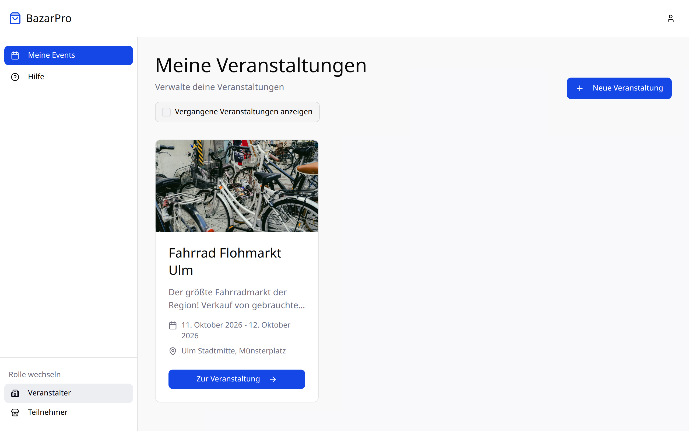
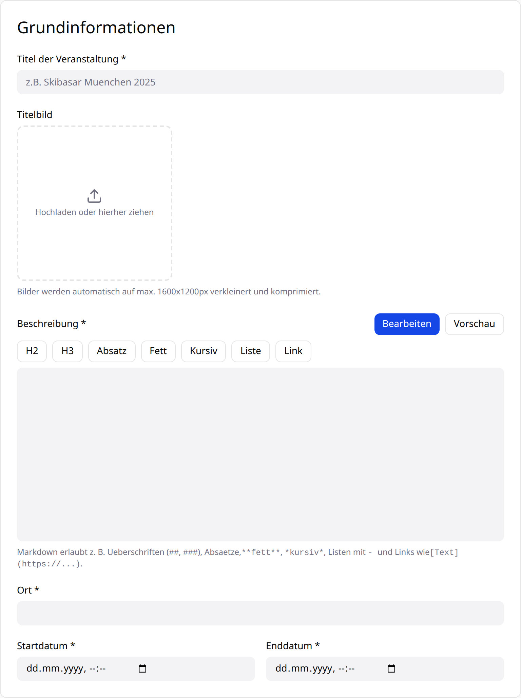
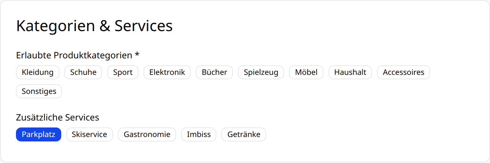
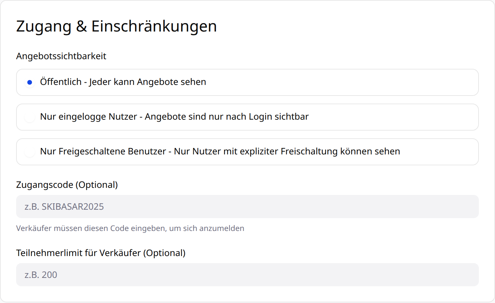
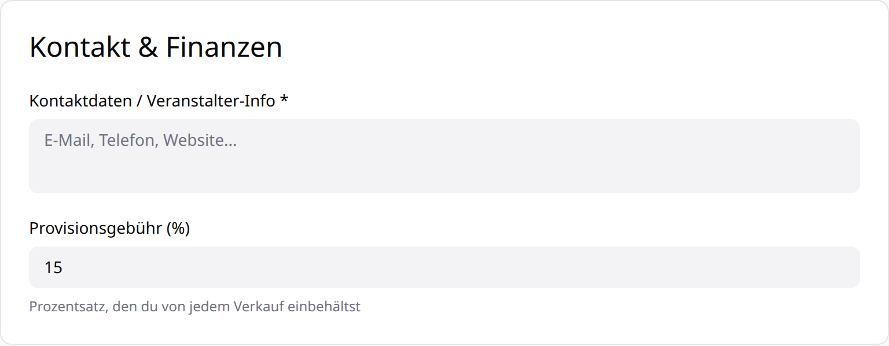
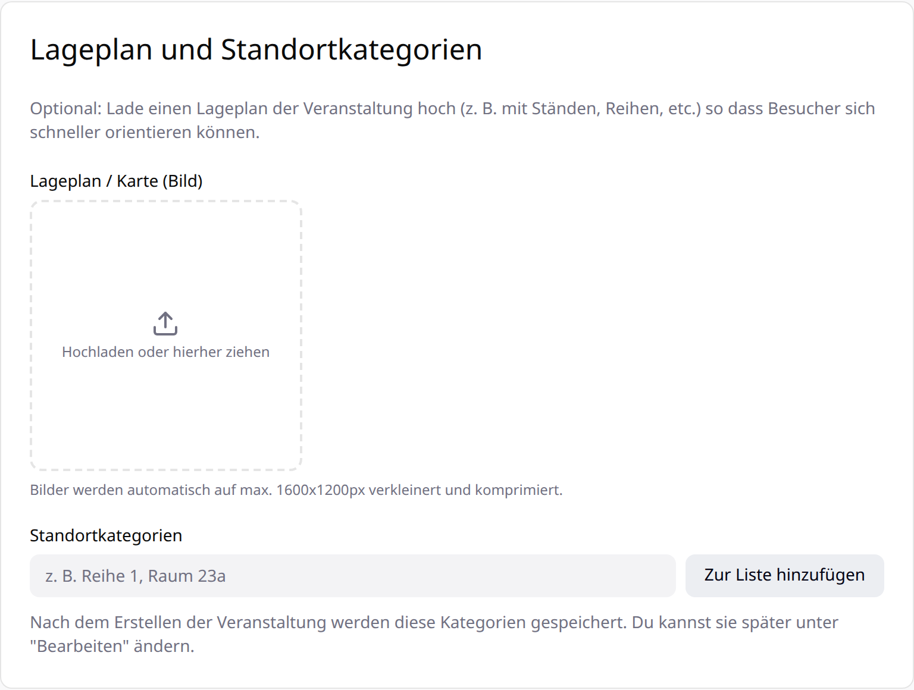

import { Aside, Steps } from '@astrojs/starlight/components';

In dieser Anleitung legst du einen Basar an: mit Termin und Ort, den erlaubten Kategorien, den Regeln für die Verkäuferanmeldung und deiner Provision. Plane dafür etwa zehn Minuten ein.

**Du brauchst:** ein BazarPro-Konto. Ein Titelbild und ein Lageplan sind optional, machen deinen Basar aber deutlich ansprechender.

## Basar anlegen

<Steps>

1. **Zur Rolle „Veranstalter“ wechseln.** Unten in der Seitenleiste unter **Rolle wechseln** auf **Veranstalter** klicken.

2. **„Neue Veranstaltung“ öffnen.** Unter **Meine Events** auf **Neue Veranstaltung** klicken.

   

   Hast du schon einmal einen Basar angelegt, kannst du oben eine **Vorlage** wählen. Dann werden die Angaben deines alten Basars übernommen und du passt nur Termin und Details an.

3. **Grundinformationen ausfüllen.**

   

   - **Titel** – mindestens 3 Zeichen, z. B. „Kinderkleiderbasar Frühjahr 2027“.
   - **Titelbild** – wird automatisch auf höchstens 1600 × 1200 Pixel verkleinert.
   - **Beschreibung** – mindestens 10 Zeichen. Du kannst Überschriften, Listen, **fett**, *kursiv* und Links verwenden. Mit **Vorschau** siehst du, wie es aussieht.
   - **Ort** – so genau wie möglich, z. B. mit Halle oder Eingang.
   - **Start- und Enddatum** – der Basar muss frühestens morgen beginnen, das Ende muss nach dem Start liegen.

4. **Kategorien und Services wählen.**

   

   Wähle mindestens eine **Produktkategorie**. Verkäufer können nur Artikel aus diesen Kategorien anbieten. Unter **Zusätzliche Services** zeigst du Besuchern, was es vor Ort gibt, zum Beispiel Parkplätze oder Getränke.

5. **Zugang und Einschränkungen festlegen.**

   

   Mit der **Angebotssichtbarkeit** bestimmst du, wer die Artikel deines Basars sehen kann:

   | Einstellung | Wer sieht die Angebote? |
   | --- | --- |
   | **Öffentlich** | Alle, auch ohne Konto. Dein Basar erscheint auf der Startseite. |
   | **Nur eingeloggte Nutzer** | Nur Besucher mit BazarPro-Konto. |
   | **Nur freigeschaltete Benutzer** | Nur Nutzer, die ausdrücklich freigeschaltet wurden. |

   Mit einem **Zugangscode** können sich nur Verkäufer anmelden, denen du den Code gibst – praktisch, wenn dein Basar nur für einen Verein oder eine Kita gedacht ist. Das **Teilnehmerlimit** begrenzt die Zahl der Verkäufer; ist es erreicht, sind keine weiteren Anmeldungen möglich.

6. **Kontaktdaten und Provision eintragen.**

   

   Die **Kontaktdaten** sehen Verkäufer und Besucher auf der Seite deines Basars. Die **Provisionsgebühr** ist der Anteil, den du von jedem Verkauf einbehältst – voreingestellt sind 15 %.

   <Aside type="tip" title="Beispiel">
     Bei 15 % Provision und einem Fahrrad für 40,00 € bekommt der Verkäufer 34,00 €, 6,00 € bleiben beim Veranstalter. Die Abrechnung rechnet das für jeden Verkäufer automatisch aus.
   </Aside>

7. **Lageplan und Standorte hinzufügen (optional).**

   

   Lade einen **Lageplan** als Bild hoch und lege **Standortkategorien** an, zum Beispiel „Halle B“ oder „Tisch 1–10“. Bei der Warenannahme ordnest du jeden Artikel einem Standort zu – Besucher sehen dann beim Scannen, wo sie ihn finden.

8. **Veranstaltung erstellen.** Ganz unten auf **Veranstaltung erstellen** klicken. Dein Basar erscheint unter **Meine Events**.

</Steps>

## Freigabe öffentlicher Basare

Damit auf der öffentlichen Startseite nur echte Basare erscheinen, prüft ein Administrator jeden **öffentlichen** Basar, bevor er sichtbar wird. Bis dahin ist er nur für dich sichtbar. Basare mit den Einstellungen **Nur eingeloggte Nutzer** oder **Nur freigeschaltete Benutzer** sind sofort aktiv.

Änderst du die Sichtbarkeit eines bestehenden Basars später auf **Öffentlich**, wird er erneut geprüft.

<Aside type="caution">
  Fehlt der Button **Neue Veranstaltung**, ist das Anlegen von Basaren auf dieser BazarPro-Instanz gerade deaktiviert. Wende dich an den Betreiber.
</Aside>

## Wie geht es weiter?

Teile den Link zu deinem Basar mit deinen Verkäufern – und, falls du einen nutzt, den Zugangscode. Wie sich Verkäufer anmelden und ihre Artikel inserieren, steht in [Einen Artikel inserieren](/verkaeufer/artikel-inserieren/).
