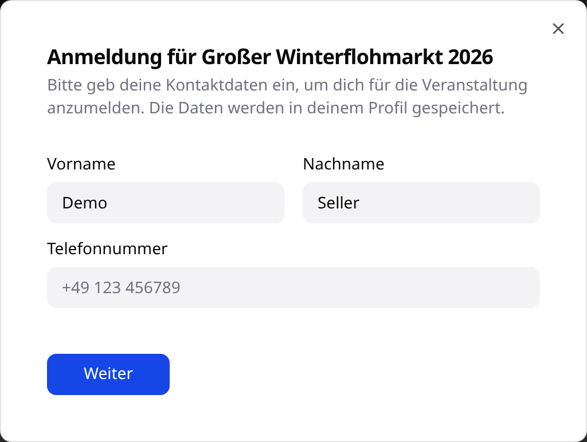
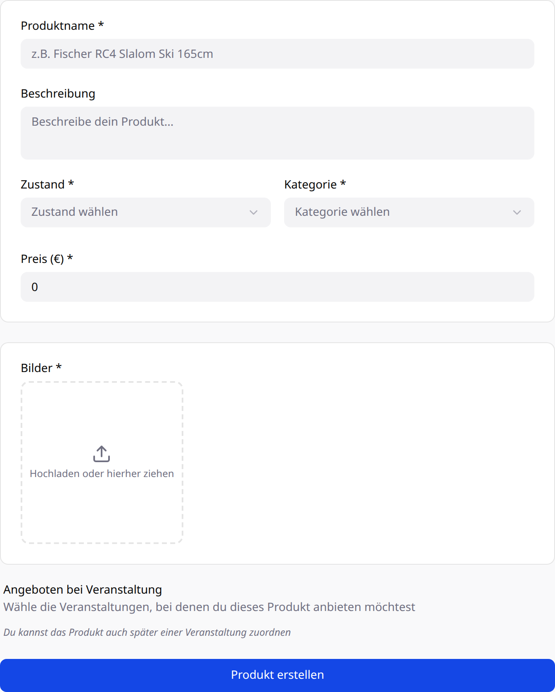
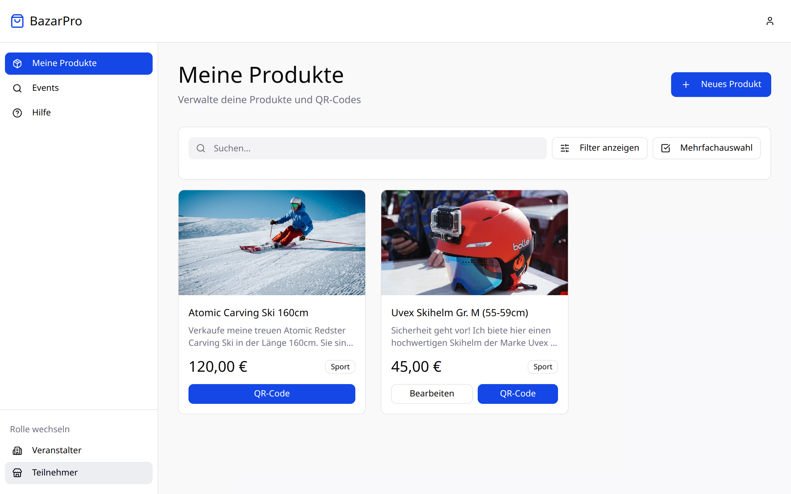

import { Aside, Steps } from '@astrojs/starlight/components';

In dieser Anleitung meldest du dich bei einem Basar als Verkäufer an, legst einen Artikel an und druckst sein QR-Etikett. Wenn du mehrere Artikel verkaufen möchtest, wiederholst du nur den zweiten Teil.

**Du brauchst:** ein BazarPro-Konto, Fotos deiner Artikel und – falls der Veranstalter einen vergibt – den Zugangscode.

## Teil 1: Beim Basar anmelden

<Steps>

1. **Zur Rolle „Teilnehmer“ wechseln.** Unten in der Seitenleiste unter **Rolle wechseln** auf **Teilnehmer** klicken.

2. **Den Basar öffnen.** Über **Events** in der Seitenleiste findest du alle Basare, an denen du teilnehmen kannst. Hat dir der Veranstalter einen Link geschickt, öffne einfach diesen.

3. **„Als Verkäufer beitreten“ klicken.**

   

4. **Kontaktdaten prüfen.** Beim ersten Mal fragt BazarPro nach Vorname, Nachname und Telefonnummer, damit dich der Veranstalter erreichen kann. Die Angaben werden in deinem Profil gespeichert. Mit **Weiter** geht es weiter.

   

5. **Zugangscode eingeben (falls nötig)** und mit **Anmelden bestätigen** abschließen.

</Steps>

<Aside type="caution" title="Anmeldung klappt nicht?">
  - **„Ungültiger Zugangscode“** – prüfe den Code beim Veranstalter, Groß- und Kleinschreibung zählt.
  - **Teilnehmerlimit erreicht** – der Basar hat bereits so viele Verkäufer, wie der Veranstalter zulässt.
  - **Veranstaltung liegt in der Vergangenheit** – bei beendeten Basaren ist keine Anmeldung mehr möglich.
</Aside>

## Teil 2: Artikel anlegen

<Steps>

1. **„Neues Produkt“ öffnen.** Unter **Meine Produkte** oben rechts auf **Neues Produkt** klicken.

2. **Angaben ausfüllen.**

   

   - **Produktname** – mindestens 3 Zeichen. Nenne Marke und Größe, z. B. „Hollandrad 28 Zoll, Rahmenhöhe 55 cm“.
   - **Beschreibung** – optional, aber hilfreich: Alter, Gebrauchsspuren, Zubehör.
   - **Zustand** – Neu, Gebraucht wie neu, Gebraucht oder Gebraucht mit Mängeln.
   - **Kategorie** – der Basar akzeptiert nur die Kategorien, die der Veranstalter freigegeben hat.
   - **Preis (€)** – dein Verkaufspreis. Die Provision des Veranstalters wird davon abgezogen.
   - **Bilder** – mindestens ein Foto.
   - **Angeboten bei Veranstaltung** – wähle den Basar aus. Du kannst einen Artikel auch mehreren Basaren zuordnen oder das später nachholen.

3. **„Produkt erstellen“ klicken.** Der Artikel steht jetzt im Basar mit dem Status **Angemeldet**.

</Steps>

<Aside type="tip" title="Gute Fotos verkaufen besser">
  Fotografiere bei Tageslicht vor einem ruhigen Hintergrund und zeige den ganzen Artikel. Ein zweites Foto von Mängeln oder Details schafft Vertrauen – und erspart Rückfragen beim Basar.
</Aside>

## Teil 3: QR-Etikett drucken und anbringen

- **Einzelnes Etikett:** auf der Artikelkarte auf **QR-Code** klicken.
- **Alle Etiketten auf einmal:** mit **Mehrfachauswahl** Artikel markieren und **QR-Codes als PDF** herunterladen.

Drucke die Etiketten aus und befestige sie gut sichtbar am Artikel – an Kleidung zum Beispiel mit einer Sicherheitsnadel, an einem Fahrrad am Lenker. Bring die Artikel dann zur Warenannahme des Basars.

## Was passiert danach?

- **Bis zur Warenannahme** kannst du den Artikel jederzeit bearbeiten oder löschen.
- **Ab der Warenannahme** ist der Artikel **Erhältlich** und für Änderungen gesperrt.
- **Während des Basars** kannst du einem erhältlichen Artikel einen **Rabatt** von bis zu 50 % geben – ein neues Etikett ist nicht nötig, weil der Preis nicht darauf steht. Den Rabatt kannst du für die Dauer des Basars nicht wieder zurücknehmen.
- **Nach dem Verkauf** siehst du den Status **Verkauft** sofort in BazarPro. Nach dem Basar holst du beim Veranstalter dein Geld und deine unverkauften Artikel ab.
